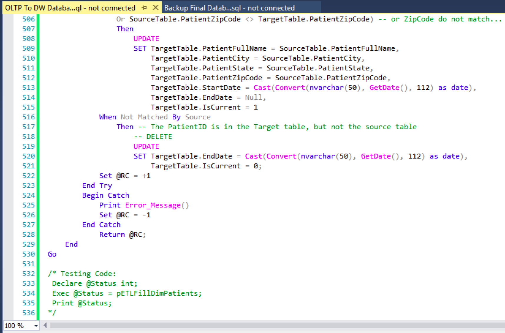

Overview
	For the INFO 498 Final I created a complex ETL processing solution. The ETL takes data from 2 OLTP databases and transfers them into a data warehouse. The SQL code files and documentation files are organized in a Microsoft Visual Studio Solution. 
The OLTP Databases
	The two OLTP databases used to fill the data warehouse were given to me as backup (.bak) files. They were easily added to SQL Server by attaching them. The first database, DoctorsSchedules contains scheduling information regarding doctors. The database contains four tables, Clinics, Doctors, Shifts, and DoctorShifts (Figure 1). 

Figure 1
The second database, Patients, contains information regarding medical patients. The database contains five tables, Clinics, Doctors, Patients, Procedures, and Visits (Figure 2). 

Figure 2
Information regarding the contents of the databases as well as the transformations needed for each attribute was placed into a worksheet (Figure 3).

Figure 3
Data Warehouse Creation
Next I created the shell of the data warehouse by running the script provided by my instructor Randal Root. The structure of the data warehouse is shown in Figure 4.

Figure 4
Loading the CSV Files
	In this example we have three csv files that would have been sent to us from each of the clinics. However, like in real life, mistakes happen and there are differences between the csv files that need to be corrected to avoid any errors when importing the data. First, each of the csv files are placed into staging tables using bulk insert statements as shown in Figure 5. 

Figure 5
	Next, I transformed the data in views as shown in Figure 6.

Figure 6
Finally, the contents of the views were inserted into the Patients.dbo.Visits table.

Figure 7
Filling the Data Warehouse
	Now that the OLTP databases are up to date with the recent reports of visitor information they can be placed into the data warehouse. First, the foreign key constraints are dropped to allow us to truncate the tables (Figure 8)(Figure 9).

Figure 8

Figure 9
The next step is to flush and fill all of the dimension and fact tables except for DimPatients, which requires an incremental load. The method I used was creating a view and stored procedure for each table. The view would transform the data, and the stored procedure would insert it. An example is shown in Figure 10 and Figure 11.

Figure 10

Figure 11
	Now we need to incrementally load the Patients table (Figure 12)(Figure 13).

Figure 12

Figure 13
 Finally, we need to add back on the foreign keys (Figure 14).

Figure 14
Creating the SSIS ETL
	Now that our ETL code is done and functioning it needs to be placed into out SSIS project. To do so I created four containers, one for before loading the data, one for filling the dimension tables, one for filling the fact tables, and one for after loading the data. Inside each container are execute SQL tasks which execute the stored procedures I created in SQL Server Management Studio. One Completed and connected the ETL process looks like Figure 15.

Figure 15
Backing Up the Databases
	The last task that needs to be completed is backing up our databases. For each database I created a stored procedure which creates a backup and restores the backup to create a read-only version of the database for reporting (Figure 16).

Figure 16
	I then used SQL Server Agent to create a job that runs each of the stored procedures daily. This will create daily backups of the databases automatically as shown in Figure 17.

Figure 17
Summary
	After completing this assignment, we have simulated what a real database administrator would need to do to run a medical database spanning multiple healthcare clinics. I demonstrated how an employee would take reports from clinics daily, import their data into OLTP databases, put the contents of those databases into a data warehouse, create backups of the database, and automate the process.
